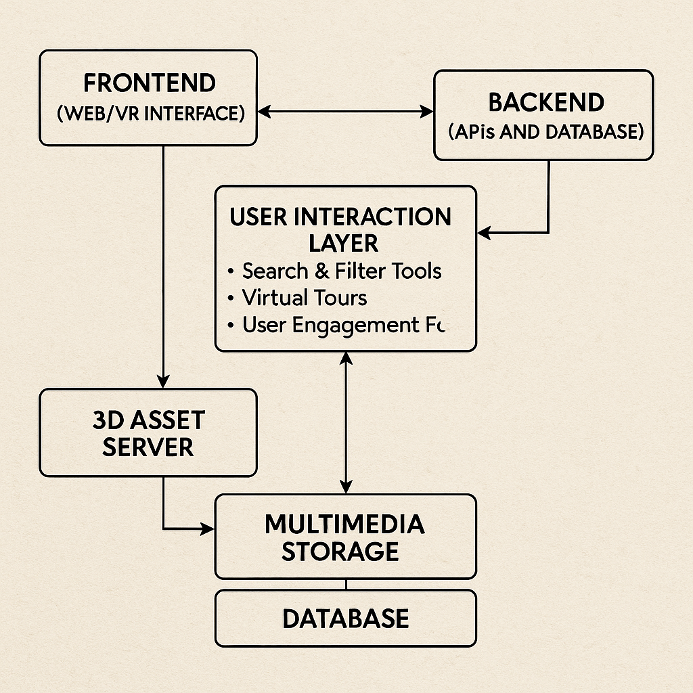

# Smart India Hackathon Workshop
# Date:30/04/2025
## Register Number: 212223220105
## Name:SHANMUGAKARTHIK G
## Problem Title
SIH 1555: Create a Virtual Herbal Garden that provides an interactive, educational, and immersive experience to users, showcasing the diverse range of medicinal plants used in AYUSH (Ayurveda, Yoga & Naturopathy, Unani, Siddha, and Homeopathy).
## Problem Description
Background: The AYUSH sector relies heavily on medicinal plants and herbs, which form the backbone of traditional healing practices. However, physical gardens that are not accessible to everyone. A Virtual Herbal Garden will bridge this gap by offering a digital platform where users can explore, learn, and understand the significance of various medicinal plants from the comfort of their homes. Description: Participants are tasked with developing a Virtual Herbal Garden that is engaging, informative, and user-friendly. This virtual garden should include: Interactive 3D Models: Realistic 3D models of medicinal plants that users can rotate, zoom, and explore from different angles. Detailed Information: Comprehensive details about each plant, including its botanical name, common names, habitat, medicinal uses, and methods of cultivation. Multimedia Integration: High-quality images, videos, and audio descriptions to enhance the learning experience. Search and Filter Options: Advanced search functionality to easily locate specific plants and filter them based on various criteria like medicinal uses, region, and type. Virtual Tours: Guided virtual tours highlighting specific themes, such as plants for digestive health, immunity, skin care, etc. User Interaction: Features that allow users to bookmark favourite plants, take notes, and share information on social media. Expected Outcome: The expected outcome is a comprehensive Virtual Herbal Garden that serves as a valuable educational tool for students, practitioners, and enthusiasts of the AYUSH sector. This platform should make the knowledge of medicinal plants accessible to a wider audience, promoting awareness and understanding of traditional herbal practices. It should be visually appealing, informative, and interactive, providing users with an immersive experience that combines technology with traditional knowledge.

## Problem Creater's Organization
Ministry of Ayush

## Idea
The core idea is to create a Virtual Herbal Garden platform that allows users to explore, learn, and interact with a wide variety of medicinal plants used in AYUSH systems—from anywhere and at any time.

This platform will combine technology with traditional herbal knowledge, using 3D models, multimedia content, and virtual tours to provide a highly engaging and educational experience. It aims to promote awareness of India’s rich medicinal plant heritage while supporting AYUSH learning for students, practitioners, and enthusiasts.

Through intuitive features like search filters, interactive tours, and plant bookmarking, users will be empowered to discover herbal solutions aligned with their interests—such as immunity boosting, digestive wellness, or skincare—making the garden not only informative but also personally relevant and accessible.

## Proposed Solution / Architecture Diagram

# Proposed Solution
The proposed solution is a web-based and VR-enabled Virtual Herbal Garden platform. It will include:

3D Interactive Models:
Realistic 3D models of plants with zoom, rotate, and explore capabilities.

Detailed Plant Profiles:
Each plant will include:

Botanical and common names

Geographic distribution

Medicinal uses (with AYUSH system relevance)

Cultivation methods and harvesting periods

Multimedia Content:

High-resolution plant images

Informative videos about usage and benefits

Audio guides for accessibility

Search & Filter Tools:

Filter by disease (e.g., immunity, digestion, skin)

Sort by region, plant family, or AYUSH system

Virtual Tours:

Thematic explorations such as:

"Plants for Immunity"

"Ayurvedic Digestive Aids"

User Engagement Features:

Bookmark favorite plants

Add notes

Share plant profiles via social media

# Architecture Diagram
## Use Cases

# Use Case
Student Learning – Botany or AYUSH students explore plant uses for academic knowledge.

Practitioners’ Reference – Quick reference for practitioners in AYUSH practices.

Public Awareness – Enthusiasts learning about herbal remedies and cultivation.

Educational Institutions – Used in classes for immersive herbal studies.

## Technology Stack

| Layer             | Tools / Technologies                                      |
|------------------|-----------------------------------------------------------|
| Frontend         | React.js / Three.js / WebGL for 3D interaction            |
| Backend          | Node.js with Express or Django                            |
| Database         | MongoDB / PostgreSQL (Plant data, user interactions)      |
| 3D Modelling     | Blender / Unity (For rendering and exporting plant models)|
| VR Support       | WebXR / A-Frame                                            |
| Multimedia Hosting | AWS S3 / Firebase Storage                               |
| Search & Filter  | ElasticSearch / Algolia                                   |
| Authentication   | Firebase Auth / OAuth                                     |

## Dependencies
1. 3D Plant Models – Requires collaboration with botanists or plant databases.

2. AYUSH Data – Sourced from Ministry of AYUSH and verified herbal texts.

3. Multimedia Content – Videos/images from reliable sources or created in-house.

4. Cloud Hosting – AWS, Firebase, or other cloud services for scalability.

5. VR Headset Compatibility – Optional but beneficial for immersive experience.